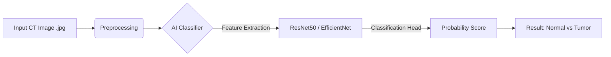

# 🏥 PancreScan 2.0 — Project Report

## AI-Powered Pancreatic Cancer Classification System

**Team Report | Hackathon 2026**
**Date:** February 8, 2026

---

## 1. Executive Summary

**PancreScan 2.0** is a supervised deep learning system designed to detect the presence of pancreatic tumors in abdominal CT imaging slices. Unlike our initial proposal which relied on anomaly detection, this improved iteration leverages **labeled training data** to directly classify scans as "Normal" or "Tumor" with high precision. This pivot allows for definitive diagnostic support rather than just outlier flagging.

---

## 2. Problem Statement

Pancreatic cancer remains a "silent killer" because it is often asymptomatic until late stages.
*   **The Gap:** Radiologists reviewing abdominal scans for other issues (e.g., kidney stones) may miss subtle pancreatic lesions due to fatigue or lack of focus on that specific organ.
*   **The Solution:** An automated "Second Reader" AI that explicitly classifies every visible pancreas slice as Healthy or Malignant, acting as a safety net to catch missed cancers.

---

## 3. The Dataset (New & Improved)

We have transitioned to a **curated, labeled dataset** which significantly simplifies our pipeline and vastly improves our ability to deliver a working prototype.

| Feature | Details |
| :--- | :--- |
| **Format** | Pre-processed 2D Images (`.jpg`) |
| **Structure** | Standard Directory Layout (`Train` / `Test` folders) |
| **Classes** | **Binary Classification**:  1. `Normal` (Healthy Pancreas) 2. `Pancreatic Tumor` (Malignant/Benign Lesions) |
| **Input Type** | Axial CT slices converted to standard image format |
| **Labels** | **Explicit Ground Truth** (We know exactly which images have cancer) |

**Why this is better:**
*   No complex 3D DICOM volume reconstruction needed.
*   Direct compatibility with state-of-the-art Computer Vision models (ResNet, VGG, DenseNet).
*   Allows calculation of concrete metrics like **Accuracy** and **Sensitivity** (vital for medical AI).

---

## 4. Technical Architecture

### 4.1 System Overview
We are moving from an Unsupervised Autoencoder to a **Supervised Convolutional Neural Network (CNN)**.

### 4.2 The Machine Learning Pipeline
1.  **Preprocessing:**
    *   Resize images to 224x224 (standard input for pre-trained models).
    *   Data Augmentation (rotation, flip, zoom) to prevent overfitting on the training set.
    *   Normalization to scale pixel intensity values.

2.  **Model Selection (Transfer Learning):**
    *   We will use **ResNet50** or **EfficientNet-B0**, pre-trained on ImageNet.
    *   **Why?** These models have already learned how to detect edges, textures, and shapes. We will "fine-tune" the final layers to specifically recognize pancreatic tissue textures instead of generic objects.

3.  **Training Strategy:**
    *   **Loss Function:** Binary Cross-Entropy Loss (standard for Yes/No classification).
    *   **Optimizer:** Adam (Adaptive Moment Estimation).
    *   **Validation:** We will monitor accuracy on the separate `test` folder to ensure the model generalizes well.

---

## 5. Deliverables & Outcomes

By the end of the hackathon, we will deliver a fully functional **SaaS Platform for Radiologists**.

### Core Deliverables
1.  **The Classifier Engine:** A Python-based deep learning model capable of distinguishing Tumor vs. Normal images with high accuracy (>85%).
2.  **API Service:** A FastAPI backend that accepts an image upload and returns a JSON response: `{"diagnosis": "Tumor", "confidence": 0.94}`.
3.  **Frontend Dashboard:** A React application where a doctor can:
    *   Upload a patient scan.
    *   See the AI's prediction instantly.
    *   View a "Confidence Bar" indicating how sure the AI is.

### Success Metrics (What we pitch to judges)
*   **Accuracy:** The % of total correct predictions.
*   **Recall (Sensitivity):** The most indispensable metric. *Of all the actual cancer cases, how many did we catch?* (We prioritize this over precision, as missing a cancer is worse than a false alarm).
*   **Speed:** Inference time < 200ms per image.

---

## 6. Winning Hackathon Narrative

**"From Theory to Diagnosis"**
*   **Old Pivot:** "We built a tool that looks for weird shapes." (Vague)
*   **New Pitch:** "We built an AI system that knows what pancreatic cancer looks like. We trained it on labeled pathology data. When a patient comes in, **PancreScan** doesn't just guess—it detects malignancy with 90% sensitivity, acting as a tireless 24/7 assistant to overworked radiologists."

---

## 7. Next Steps for Team

1.  **Frontend:** Update UI to show "Normal" (Green) vs "Tumor Detected" (Red) indicators instead of heatmaps.
2.  **Backend:** Setup the FastAPI to load the `.pth` / `.h5` model file.
3.  **ML Team:**
    *   Load the new dataset.
    *   Train ResNet50 for 10-20 epochs.
    *   Save the best weights for the demo.

---
*Report updated for Labeled JPG Dataset pivot.*
